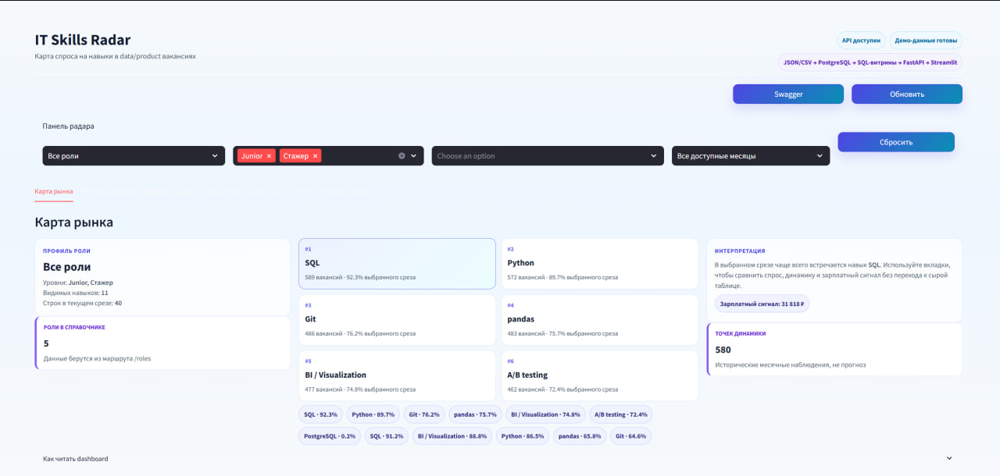
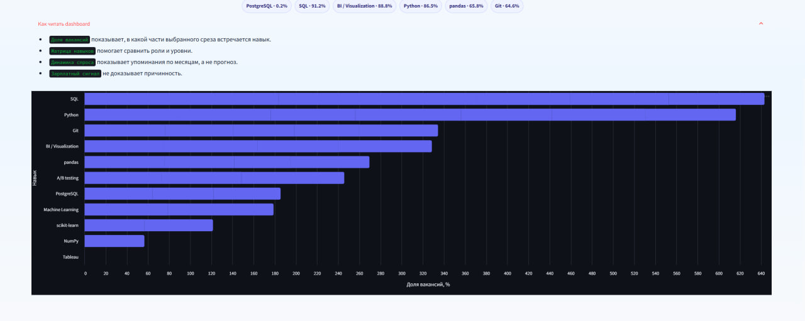
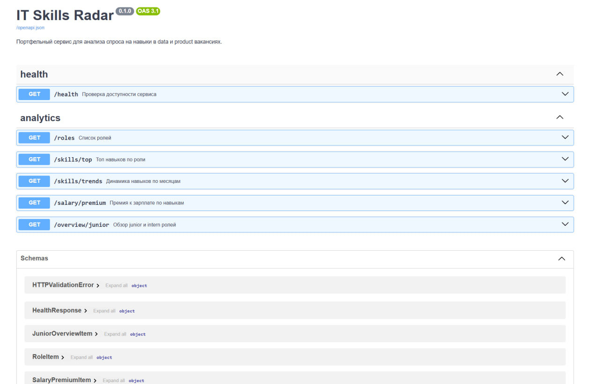

# IT Skills Radar

`IT Skills Radar` — портфельный data-проект, который показывает, какие навыки чаще всего требуются в data/product вакансиях, как меняется спрос по времени и какие навыки связаны с более высокой зарплатой.


## Коротко

Проект демонстрирует полный путь данных от сырого источника до готового интерфейса:

1. загрузка вакансий из подготовленных `JSON/CSV`;
2. валидация и очистка данных;
3. нормализация ролей и навыков;
4. хранение в `PostgreSQL`;
5. аналитические SQL-витрины;
6. `FastAPI` для доступа к агрегатам;
7. `Streamlit` dashboard на русском языке с блоком проверки демо.

Проект intentionally сделан без enterprise-перегруза: простая архитектура, понятный код и воспроизводимый запуск через Docker.

Dashboard сделан как отдельный `skills market radar`: верхняя командная панель, горизонтальные фильтры без sidebar, вкладки рабочего пространства, skill chips, ранжированные skill tiles, светлые графики, объяснения метрик и smoke checks для API/БД.

## Скриншоты

### Dashboard: карта рынка



### Dashboard: топ навыков



### FastAPI Swagger



## Что можно узнать

- Какие навыки чаще всего встречаются в вакансиях.
- Какие навыки характерны для `Data Scientist`, `Data Analyst`, `Product Analyst`, `ML Engineer`.
- Как меняется спрос на навыки по месяцам.
- Какие навыки связаны с более высокой медианной зарплатой.
- Как выглядит рынок junior / intern data/product ролей.

## Для кого проект

Для `Data Scientist` проект показывает работу с подготовкой данных, нормализацией, SQL, аналитическими витринами и базовой инженерной упаковкой.

Для `Product / Data Analyst` проект показывает умение переводить бизнес-вопросы в метрики, сегменты, витрины и понятный dashboard.

## Стек

| Слой | Инструменты |
| --- | --- |
| Backend | Python 3.11, FastAPI |
| Data storage | PostgreSQL |
| Analytics | SQL views, Python services |
| Dashboard | Streamlit |
| Infrastructure | Docker Compose |
| Quality | pytest, GitHub Actions |

## Архитектура

```text
Prepared JSON/CSV
      |
      v
Ingestion + validation
      |
      v
Cleaning + rule-based normalization
      |
      v
PostgreSQL: raw + final tables
      |
      v
Analytics SQL views
      |
      v
FastAPI endpoints
      |
      v
Streamlit dashboard
```

Главная идея: тяжелые аналитические расчеты живут в PostgreSQL views, API остается тонким, а dashboard только запрашивает готовые агрегаты.

Подробности:
- [Архитектура](docs/architecture.md)
- [Словарь данных](docs/data_dictionary.md)
- [Решения по нормализации](docs/decisions.md)
- [Описание метрик](docs/analytics.md)

## Быстрый запуск

Требования:
- Docker Desktop
- Docker Compose

```powershell
Copy-Item .env.example .env
docker compose up --build -d
docker compose exec api python -m app.db.prepare_demo
```

API-контейнер при старте применяет схему, аналитические витрины и seed-данные. Команда `prepare_demo` повторно готовит базу для демонстрации. Если нужно выполнить шаги вручную:

```powershell
make init-db
make init-analytics
make seed-db
```

Загрузить sample-данные через ingestion pipeline:

```powershell
docker compose exec api python -m app.services.ingestion --input data/samples/prepared_vacancies.json --source manual
docker compose exec api python -m app.services.ingestion --input data/samples/prepared_vacancies.csv --source manual
```

## Проверка на 10 000 строк

Для проверки производительности ingestion, PostgreSQL views, API и dashboard можно сгенерировать большой реалистичный набор подготовленных вакансий. Файл создается локально в `data/generated/` и не хранится в Git.

```powershell
py -3 -m app.services.large_sample --rows 10000 --output data/generated/large_vacancies_10000.json
docker compose exec api python -m app.services.ingestion --input data/generated/large_vacancies_10000.json --source manual
```

То же через Makefile:

```powershell
make load-test-10k
```

После загрузки проверьте API:

```powershell
Invoke-RestMethod "http://localhost:8000/skills/top?rank_limit=10"
Invoke-RestMethod "http://localhost:8000/overview/junior"
```

Открыть:
- API: [http://localhost:8000](http://localhost:8000)
- Swagger: [http://localhost:8000/docs](http://localhost:8000/docs)
- Dashboard: [http://localhost:8501](http://localhost:8501)

В dashboard есть вкладка `Проверка демо`: она показывает, доступны ли `/health`, `/roles`, аналитические endpoints, база данных, SQL-витрины и демо-данные.

## Проверка без записи в БД

```powershell
docker compose exec api python -m app.services.ingestion --input data/samples/prepared_vacancies.json --source manual --dry-run
```

## Troubleshooting

Если dashboard показывает ошибку `/roles`:

1. Проверьте, что контейнеры запущены:

```powershell
docker compose ps
```

2. Проверьте API:

```powershell
Invoke-WebRequest http://localhost:8000/health
Invoke-WebRequest http://localhost:8000/roles
```

3. Повторно примените схему и витрины:

```powershell
make init-db
make init-analytics
make seed-db
```

4. Откройте Swagger:

[http://localhost:8000/docs](http://localhost:8000/docs)

## API

| Endpoint | Назначение |
| --- | --- |
| `GET /health` | Проверка доступности API |
| `GET /roles` | Список ролей для фильтров |
| `GET /skills/top` | Топ навыков по роли и уровню |
| `GET /skills/trends` | Динамика навыков по месяцам |
| `GET /salary/premium` | Salary premium по навыкам |
| `GET /overview/junior` | Обзор junior / intern ролей |

## Аналитические витрины

| Витрина | Что показывает |
| --- | --- |
| `analytics.top_skills_by_role` | Самые частые навыки внутри роли |
| `analytics.skills_trend_monthly` | Помесячную динамику спроса |
| `analytics.role_skill_distribution` | Отличия навыков между ролями |
| `analytics.skill_salary_premium` | Разницу медианной зарплаты с навыком и без него |
| `analytics.junior_roles_overview` | Срез по junior / intern вакансиям |

## Структура проекта

```text
IT_Skills_Radar
├── app
│   ├── api
│   ├── core
│   ├── db
│   ├── schemas
│   └── services
├── dashboard
├── data/samples
├── docs
├── sql
├── tests
├── docker-compose.yml
├── Dockerfile
├── Makefile
├── README.md
└── requirements.txt
```

## Тесты

```powershell
py -3 -m compileall app dashboard tests
py -3 -m pytest -q
```

Через Makefile:

```powershell
make check
```

В CI GitHub Actions запускает установку зависимостей, проверку компиляции и `pytest`.

## Demo-сценарий

1. Открыть dashboard.
2. В горизонтальной панели выбрать роль `Data Scientist` или `Product Analyst`.
3. Оставить уровни `junior` и `intern`, выбрать 1-3 навыка для динамики.
4. На вкладке `Карта рынка` показать профиль роли, skill chips и ranked tiles.
5. На вкладке `Матрица навыков` показать различия спроса по навыкам.
6. На вкладке `Динамика спроса` показать месячную динамику навыков.
7. На вкладке `Зарплатный сигнал` объяснить salary premium без причинных выводов.
8. Завершить вкладками `Junior / Intern` и `Проверка демо`.

Подробный чеклист: [docs/demo_checklist.md](docs/demo_checklist.md)

## Что демонстрирует проект

- `Python` для data processing и backend-логики.
- `SQL/PostgreSQL` для хранения данных и аналитических витрин.
- Проектирование простой, но практичной data model.
- Rule-based нормализацию ролей и навыков.
- `FastAPI` для доступа к аналитическим агрегатам.
- `Streamlit` для понятного dashboard.
- `Docker Compose`, `pytest`, `GitHub Actions` для воспроизводимости и качества.

## Документы для собеседования

- [Bullet points для резюме](docs/resume_bullets.md)
- [Interview story](docs/interview_story.md)

## Ограничения

- Источник данных сейчас подготовленный: локальные `JSON/CSV`, без live scraping/API.
- Нормализация ролей и навыков rule-based, без тяжелого NLP.
- Salary premium показывает аналитическую связь, а не причинно-следственный эффект.
- Проект сфокусирован на portfolio-ready MVP, поэтому архитектура оставлена простой.

## Лицензия

Проект распространяется по лицензии [MIT](LICENSE).
