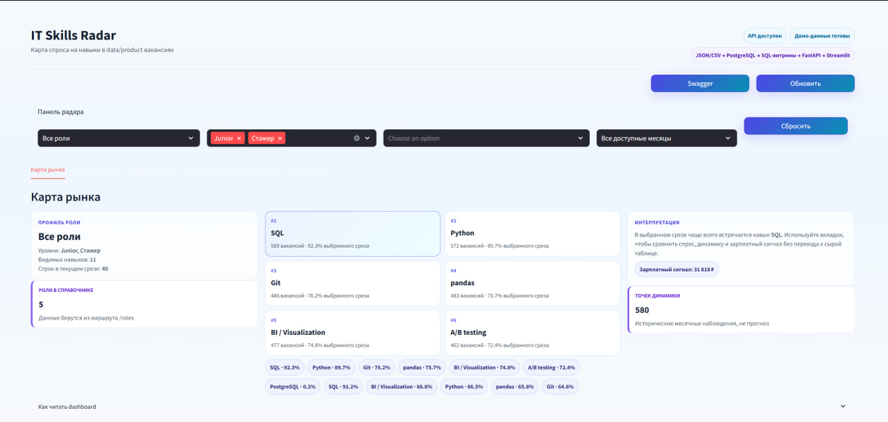
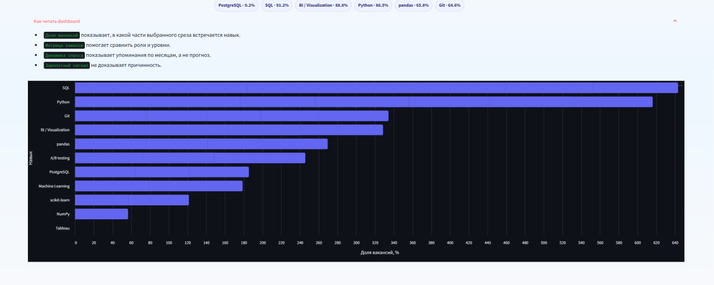
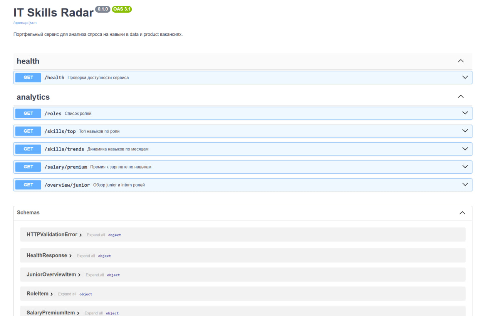

# IT Skills Radar

`IT Skills Radar` — portfolio data-project на подготовленных данных вакансий junior/intern data-product ролей. Проект показывает, какие навыки чаще встречаются в вакансиях, как спрос меняется по месяцам, чем отличаются роли и какие навыки дают зарплатный аналитический сигнал без причинных выводов.

## Executive Summary

Проект строит воспроизводимый аналитический пайплайн: `JSON/CSV -> validation -> cleaning -> normalization -> PostgreSQL -> SQL views -> FastAPI -> Streamlit`.

Данные: подготовленные вакансии из локальных `JSON/CSV` sample-файлов. Это не live-мониторинг рынка труда, а аккуратно оформленный портфельный data-проект на подготовленном наборе вакансий.

Что демонстрирует: data cleaning, rule-based normalization ролей и навыков, SQL modeling, PostgreSQL views, API, dashboard, Docker, pytest и CI.

Почему релевантно для Product/Data Analyst и Data Analyst: проект переводит размытый бизнес-вопрос "какие навыки важны для junior data/product ролей" в метрики, витрины, фильтры, dashboard и честную интерпретацию ограничений данных.

## Что я сделал как аналитик

- Настроил ingestion подготовленных вакансий из `JSON/CSV`.
- Добавил validation обязательных полей и типов данных.
- Очистил зарплаты, даты, seniority, источники и текстовые поля.
- Нормализовал роли в аналитические категории: `Data Analyst`, `Product Analyst`, `Data Scientist`, `ML Engineer`, `BI Analyst`.
- Нормализовал skills через словарь с alias-ами, чтобы `postgres`, `PostgreSQL` и похожие варианты считались как один навык.
- Спроектировал PostgreSQL-модель: raw/final слой, роли, навыки, вакансии, связь vacancy-skill и salary table.
- Собрал SQL-витрины для top skills, role-skill distribution, monthly trends и salary premium.
- Поднял FastAPI endpoints для аналитических агрегатов.
- Собрал Streamlit dashboard как рабочий инструмент анализа: фильтры, вкладки, skill chips, таблицы, графики и проверка демо.

## Системный анализ

Проект описан как система в [docs/system-analysis](docs/system-analysis/README.md). Всё, чего нет в коде, помечено как проектное решение (TO-BE).

| Артефакт | Что внутри |
|---|---|
| [Бизнес-контекст](docs/system-analysis/01-business-context.md) | Проблема, стейкхолдеры, границы, метрики успеха |
| [Требования](docs/system-analysis/02-requirements.md) | User stories с критериями приёмки (Given/When/Then), use case, НФТ, MoSCoW |
| [Процесс AS-IS / TO-BE](docs/system-analysis/03-process-bpmn.md) | Загрузка вакансий: ручная сейчас и автоматическая в целевом состоянии |
| [Модель данных](docs/system-analysis/04-data-model.md) | ER-диаграмма, словарь данных, ограничения, витрины `analytics.*` |
| [API](docs/system-analysis/05-api.md) | [OpenAPI 3.0](docs/system-analysis/api/openapi.yaml), коды ошибок, problem+json |
| [Sequence-диаграммы](docs/system-analysis/06-sequence.md) | Загрузка, запрос дашборда, обработка ошибок валидации |
| [Интеграция](docs/system-analysis/07-integration.md) | Событие `vacancy.ingested.v1`, JSON Schema, идемпотентность, ретраи, DLQ |
| [НФТ и архитектура](docs/system-analysis/08-nfr-architecture.md) | C4 Context и Container, нефункциональные требования, наблюдаемость |

Диаграммы — Mermaid (GitHub рисует их на странице), исходники PlantUML лежат в [diagrams/](docs/system-analysis/diagrams/).

## Скриншоты

### Dashboard: Market Overview



Показано: обзор выбранной роли, ключевые навыки, доли вакансий и быстрые аналитические сигналы.

Зачем нужно: помогает быстро понять профиль роли и перейти от общего обзора к деталям по skills.

Вывод: dashboard работает как аналитический workspace, а не просто набор графиков: сначала дает контекст, затем позволяет провалиться в распределения, тренды и salary signal.

### Dashboard: Top Skills



Показано: ранжирование навыков по частоте упоминания в вакансиях с фильтрами по роли и seniority.

Зачем нужно: отвечает на вопрос, какие навыки чаще всего стоит проверять, учить или выносить в резюме для выбранного сегмента вакансий.

Вывод: SQL, Python и BI-инструменты ожидаемо формируют ядро требований, но точный порядок зависит от роли и выбранного уровня.

### FastAPI Swagger



Показано: документированные API endpoints для health-check, ролей, top skills, trends, salary premium и junior overview.

Зачем нужно: отделяет аналитический слой от UI и показывает, что dashboard читает воспроизводимые агрегаты через API.

Вывод: проект упакован как маленький data product: витрины можно использовать не только в Streamlit, но и через сервисный слой.

## Стек

| Слой | Инструменты |
| --- | --- |
| Backend | Python 3.11, FastAPI |
| Data storage | PostgreSQL |
| Analytics | SQL views, Python services |
| Dashboard | Streamlit |
| Infrastructure | Docker Compose |
| Quality | pytest, GitHub Actions |

## Архитектура

```text
Prepared JSON/CSV
      |
      v
Ingestion + validation
      |
      v
Cleaning + rule-based normalization
      |
      v
PostgreSQL: raw + final tables
      |
      v
Analytics SQL views
      |
      v
FastAPI endpoints
      |
      v
Streamlit dashboard
```

Главная идея: тяжелые аналитические расчеты живут в PostgreSQL views, API остается тонким, а dashboard запрашивает готовые агрегаты.

Документация:
- [Архитектура](docs/architecture.md)
- [Словарь данных](docs/data_dictionary.md)
- [Решения по нормализации](docs/decisions.md)
- [Описание метрик](docs/analytics.md)

## Аналитические витрины

| Витрина | Grain | Основные поля | Бизнес-вопрос |
| --- | --- | --- | --- |
| `analytics.top_skills_by_role` | 1 строка = роль + seniority + skill | `role_code`, `seniority_level`, `skill_slug`, `vacancy_count`, `vacancy_share`, `skill_rank` | Какие навыки чаще всего встречаются внутри выбранной роли и уровня? |
| `analytics.role_skill_distribution` | 1 строка = роль + seniority + skill | `role_code`, `seniority_level`, `skill_slug`, `skill_penetration_in_role`, `role_share_of_skill`, `required_share` | Какие навыки отличают роли друг от друга и где навык наиболее характерен? |
| `analytics.skills_trend_monthly` | 1 строка = месяц + роль + seniority + skill | `month_start`, `role_code`, `seniority_level`, `skill_slug`, `vacancy_count`, `vacancy_share` | Как меняется доля вакансий с навыком по месяцам? |
| `analytics.skill_salary_premium` | 1 строка = роль + seniority + skill для сопоставимых зарплат | `role_code`, `seniority_level`, `skill_slug`, `vacancies_with_skill`, `vacancies_without_skill`, `median_salary_with_skill`, `median_salary_without_skill`, `salary_premium_abs`, `salary_premium_pct` | С какими навыками в данных связан более высокий медианный salary signal? |
| `analytics.junior_roles_overview` | 1 строка = роль + seniority | `role_code`, `seniority_level`, `total_vacancies`, `salary_vacancies`, `salary_coverage`, `median_salary_mid` | Как выглядит базовый срез junior/intern ролей и насколько покрыты зарплаты? |

`salary premium` трактуется только как аналитический сигнал: это сравнение медиан вакансий с навыком и без него в сопоставимом зарплатном срезе `RUB/month`, а не доказательство, что навык сам повышает зарплату.

## API

| Endpoint | Назначение |
| --- | --- |
| `GET /health` | Проверка доступности API |
| `GET /roles` | Список ролей для фильтров |
| `GET /skills/top` | Топ навыков по роли и уровню |
| `GET /skills/trends` | Динамика навыков по месяцам |
| `GET /salary/premium` | Salary signal по навыкам |
| `GET /overview/junior` | Обзор junior/intern ролей |

## Dashboard Storytelling

Dashboard сделан как инструмент анализа, а не как статичная галерея графиков:

- верхняя панель фиксирует выбранный сегмент: роль, seniority и skills;
- вкладка `Карта рынка` дает быстрый профиль роли;
- `Матрица навыков` помогает сравнить роли по проникновению навыков;
- `Динамика спроса` показывает помесячные изменения долей;
- `Зарплатный сигнал` отделяет correlation signal от причинного вывода;
- `Junior / Intern` показывает общий срез по начальным ролям;
- `Проверка демо` подтверждает доступность API, БД, SQL-витрин и demo data.

## Быстрый запуск

Требования:
- Docker Desktop
- Docker Compose

```bash
cp .env.example .env
docker compose up --build -d
docker compose exec api python -m app.db.prepare_demo
```

API-контейнер при старте применяет схему, аналитические витрины и seed-данные. Команда `prepare_demo` повторно готовит базу для демонстрации. Если нужно выполнить шаги вручную:

```bash
make init-db
make init-analytics
make seed-db
```

Загрузить sample-данные через ingestion pipeline:

```bash
docker compose exec api python -m app.services.ingestion --input data/samples/prepared_vacancies.json --source manual
docker compose exec api python -m app.services.ingestion --input data/samples/prepared_vacancies.csv --source manual
```

Открыть:
- API: [http://localhost:8000](http://localhost:8000)
- Swagger: [http://localhost:8000/docs](http://localhost:8000/docs)
- Dashboard: [http://localhost:8501](http://localhost:8501)

## Проверка на 10 000 строк

Для проверки ingestion, PostgreSQL views, API и dashboard можно сгенерировать большой реалистичный набор подготовленных вакансий. Файл создается локально в `data/generated/` и не хранится в Git.

```bash
python -m app.services.large_sample --rows 10000 --output data/generated/large_vacancies_10000.json
docker compose exec api python -m app.services.ingestion --input data/generated/large_vacancies_10000.json --source manual
```

То же через Makefile:

```bash
make load-test-10k
```

После загрузки можно проверить API:

```bash
curl "http://localhost:8000/skills/top?rank_limit=10"
curl "http://localhost:8000/overview/junior"
```

## Проверка без записи в БД

```bash
docker compose exec api python -m app.services.ingestion --input data/samples/prepared_vacancies.json --source manual --dry-run
```

## Тесты

```bash
python -m compileall app dashboard tests
python -m pytest -q
```

Через Makefile:

```bash
make check
```

В CI GitHub Actions запускает установку зависимостей, проверку компиляции и `pytest`.

## Demo-сценарий

1. Открыть dashboard.
2. В верхней панели выбрать роль `Data Scientist` или `Product Analyst`.
3. Оставить уровни `junior` и `intern`, выбрать 1-3 навыка для динамики.
4. На вкладке `Карта рынка` показать профиль роли, skill chips и ranked tiles.
5. На вкладке `Матрица навыков` показать различия спроса по навыкам.
6. На вкладке `Динамика спроса` показать месячную динамику навыков.
7. На вкладке `Зарплатный сигнал` объяснить salary premium без причинных выводов.
8. Завершить вкладками `Junior / Intern` и `Проверка демо`.

Подробный чеклист: [docs/demo_checklist.md](docs/demo_checklist.md)

## Ограничения анализа

- Данные являются подготовленным набором вакансий, а не полной репрезентативной выгрузкой рынка труда.
- Нельзя делать причинные выводы по зарплате: наличие навыка в вакансии не доказывает, что именно он повышает зарплату.
- Вакансии не доказывают карьерный рост и не показывают реальные траектории сотрудников.
- Данные могут быть смещены по источнику, периоду сбора, регионам, компаниям и формулировкам вакансий.
- Зарплаты указаны не во всех вакансиях, поэтому salary analytics подвержена selection bias.
- Rule-based extraction навыков может пропускать синонимы или засчитывать неоднозначные формулировки.
- `salary premium` — это аналитический сигнал для проверки гипотез, а не доказательство причинности.

## Структура проекта

```text
IT_Skills_Radar
├── app
│   ├── api
│   ├── core
│   ├── db
│   ├── schemas
│   └── services
├── dashboard
├── data/samples
├── docs
│   ├── images
│   └── system-analysis
├── sql
├── tests
├── docker-compose.yml
├── Dockerfile
├── Makefile
└── requirements.txt
```

## Лицензия

Проект распространяется по лицензии [MIT](LICENSE).
