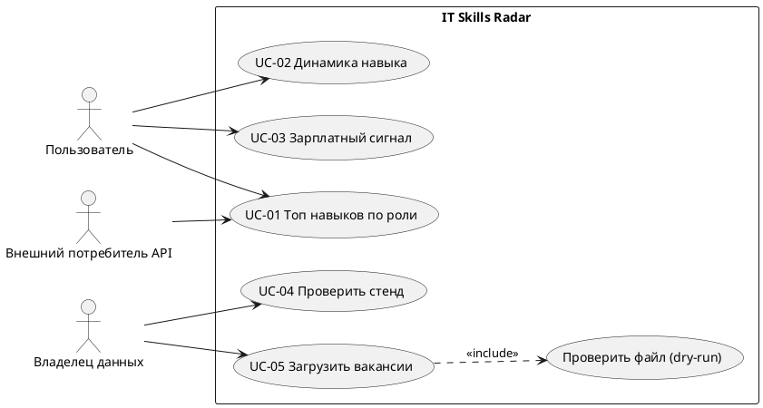

# 02. Требования

Связано с целями BG-01…BG-03 из [01-business-context.md](01-business-context.md).

> Критерии приёмки сформулированы как требования. Параметры и поведение API соответствуют коду (`app/api/routes.py`). Точные тексты сообщений в UI и пороги, которых нет в коде, отмечены как (проектное решение, в текущей реализации отсутствует).

## 1. User stories

### US-01. Топ навыков для роли и грейда · Must · BG-01

Как **junior-аналитик**, я хочу видеть самые частые навыки для выбранной роли и грейда, чтобы расставить приоритеты в обучении.

```text
AC1  Given в витрине analytics.top_skills_by_role есть строки для role_code=data_analyst и seniority_level=junior
     When я выбираю в разделе «Карта рынка» роль «Data Analyst» и грейд «junior»
     Then я вижу не более 10 навыков, отсортированных по skill_rank по возрастанию,
          и для каждого — vacancy_count и vacancy_share в процентах

AC2  Given для выбранной комбинации роль + грейд нет вакансий
     When я применяю фильтр
     Then вижу сообщение «Нет данных для выбранных фильтров» вместо пустого графика
          (текст сообщения — проектное решение, в текущей реализации отсутствует)

AC3  Given API вызывается с rank_limit=31 или rank_limit=0
     When запрос обрабатывается
     Then API возвращает 422 и не обращается к базе данных (ограничение 1 ≤ rank_limit ≤ 30)
```

### US-02. Помесячная динамика навыка · Must · BG-01

Как **junior-аналитик**, я хочу видеть, как меняется доля вакансий с навыком по месяцам, чтобы понять, растёт ли спрос.

```text
AC1  Given в витрине analytics.skills_trend_monthly есть данные по skill_slug=python
     When я выбираю навык Python в разделе «Динамика спроса»
     Then вижу линию по month_start со значениями vacancy_share и vacancy_count

AC2  Given у вакансии нет published_at
     When витрина агрегирует данные
     Then месяц определяется по collected_at (COALESCE(published_at, collected_at))
```

### US-03. Сравнение ролей по навыкам · Should · BG-01

Как **ментор**, я хочу сравнить, насколько навык распространён в разных ролях, чтобы советовать смену трека.

```text
AC1  Given выбран навык sql
     When я открываю раздел «Матрица навыков»
     Then для каждой роли вижу skill_penetration_in_role и required_share

AC2  Given внешний потребитель вызывает GET /skills/distribution
     When запрос корректен
     Then получает строки витрины analytics.role_skill_distribution
          (эндпоинт — проектное решение, в текущей реализации отсутствует;
           Pydantic-схема RoleSkillDistributionItem в коде уже есть)
```

### US-04. Зарплатный сигнал навыка · Should · BG-02

Как **junior-аналитик**, я хочу сравнить медианную зарплату вакансий с навыком и без него, чтобы понять, какие навыки связаны с более высокими предложениями.

```text
AC1  Given выбран навык sql и роль data_analyst
     When я открываю раздел «Зарплатный сигнал»
     Then вижу median_salary_with_skill, median_salary_without_skill,
          salary_premium_abs, salary_premium_pct и дисклеймер «Это корреляция, а не причинность»

AC2  Given в выборке есть зарплаты в USD или с периодом year
     When витрина считает медианы
     Then учитываются только вакансии с currency_code='RUB' и salary_period='month'

AC3  Given в одной из групп (с навыком / без навыка) меньше 5 вакансий с зарплатой
     When я открываю раздел
     Then значение помечено «Мало данных», премия не выделяется цветом
          (порог 5 — параметр min_sample_size; проектное решение, в текущей реализации отсутствует)
```

### US-05. Срез junior/intern-рынка · Should · BG-01

Как **студент**, я хочу видеть сводку по junior- и intern-вакансиям, чтобы оценить входной рынок.

```text
AC1  Given в базе есть активные вакансии с seniority_level in ('intern','junior')
     When я открываю раздел «Junior / Intern»
     Then для каждой роли и грейда вижу total_vacancies, salary_vacancies,
          salary_coverage, median_salary_mid и average_salary_mid

AC2  Given вакансия неактивна (is_active=false)
     When витрина пересчитывается
     Then вакансия не попадает в срез
```

### US-06. Идемпотентная загрузка · Must · BG-03

Как **владелец данных**, я хочу, чтобы повторная загрузка того же файла не создавала дублей, чтобы метрики не искажались.

```text
AC1  Given файл prepared_vacancies.json уже загружен с --source manual
     When я запускаю загрузку повторно
     Then количество строк в vacancies не меняется,
          изменённые поля обновлены (upsert по source_name + source_vacancy_id),
          updated_at обновлён

AC2  Given у вакансии изменился список навыков
     When я загружаю новую версию
     Then связи vacancy_skills пересобраны заново, старые связи удалены

AC3  Given я запускаю загрузку с --dry-run
     When обработка завершена
     Then в БД ничего не записано, а loaded_records = 0
```

### US-07. Отчёт об отклонённых записях · Must · BG-03

Как **владелец данных**, я хочу видеть, какие записи отклонены и почему, чтобы исправить источник.

```text
AC1  Given в файле есть запись без company_name
     When я запускаю загрузку
     Then запись пропущена, invalid_records увеличен на 1,
          в errors есть сообщение «Missing required field: company_name»

AC2  Given загрузка завершена
     When я смотрю вывод CLI
     Then вижу JSON-сводку: total_records, valid_records, invalid_records, loaded_records, errors

AC3  Given загрузка завершена
     When я открываю журнал загрузок
     Then вижу запись о прогоне с run_id, временем и счётчиками
          (таблица ingestion_runs — проектное решение, в текущей реализации отсутствует)
```

### US-08. Проверка стенда · Could · BG-03

Как **разработчик**, я хочу видеть в разделе «Проверка демо» статус API, БД, витрин и данных, чтобы быстро диагностировать стенд перед показом.

```text
AC1  Given API запущен
     When вызывается GET /health
     Then ответ 200 и тело {"status": "ok"}

AC2  Given БД не инициализирована или витрины не созданы
     When дашборд запрашивает аналитический эндпоинт
     Then API возвращает 503 с описанием операции, а раздел показывает проблемный компонент
```

## 2. Use case UC-01 «Просмотреть топ навыков по роли»

| Поле | Значение |
|---|---|
| ID | UC-01 |
| Актор | Пользователь (студент / junior-аналитик) |
| Вторичные акторы | FastAPI, PostgreSQL |
| Цель | Узнать самые частые навыки для роли и грейда |
| Уровень | Пользовательская цель |
| Предусловия | Стенд запущен (`docker compose up`), выполнен `prepare_demo`, витрина `analytics.top_skills_by_role` создана |
| Триггер | Пользователь открывает раздел «Карта рынка» |
| Гарантия успеха | Показан список навыков с рангом, числом и долей вакансий |
| Минимальная гарантия | Данные не изменены (операция только читает); пользователь видит понятное сообщение об ошибке |
| Связи | US-01, BG-01, `GET /roles`, `GET /skills/top`, SD-02 |

**Основной поток**

1. Пользователь открывает раздел «Карта рынка».
2. Дашборд запрашивает `GET /roles` и показывает фильтры роли и грейда.
3. Пользователь выбирает роль (например, `data_analyst`) и один или несколько грейдов.
4. Дашборд вызывает `GET /skills/top?role_code=data_analyst&seniority_levels=junior&rank_limit=10`.
5. API валидирует параметры и читает витрину `analytics.top_skills_by_role` через `AnalyticsService`.
6. API возвращает `200` со списком `TopSkillItem`.
7. Дашборд показывает график и таблицу: навык, `vacancy_count`, `vacancy_share`, `skill_rank`.
8. Пользователь изучает результат. Сценарий завершён.

**Альтернативные потоки**

- 3a. Пользователь не выбрал роль → `role_code` не передаётся, API возвращает навыки по всем ролям → шаг 6.
- 3b. Пользователь меняет количество навыков → дашборд передаёт новый `rank_limit` (1–30) → шаг 4.
- 6a. Витрина вернула пустой список → дашборд показывает «Нет данных для выбранных фильтров» и предлагает сбросить грейд.

**Исключения**

- 5a. `rank_limit` вне диапазона 1–30 или не число → API возвращает `422`; дашборд показывает «Некорректный фильтр» и возвращает значение по умолчанию 10.
- 5b. БД недоступна или витрины не созданы (`SQLAlchemyError`) → API возвращает `503` с `detail`; дашборд показывает «Сервис временно недоступен».
- 5c. Непредвиденная ошибка → API возвращает `500`.
- 4a. API не ответил за 20 с (таймаут `ApiClient`) или соединение не установлено → дашборд показывает ошибку соединения; повтор запроса выполняет пользователь.

**Бизнес-правила**

- BR-01. Ранг навыка считается внутри группы «роль + грейд» по убыванию `vacancy_count` (`ROW_NUMBER()`).
- BR-02. Учитываются только активные вакансии (`is_active = true`).
- BR-03. `vacancy_share` = число вакансий с навыком / число вакансий в группе «роль + грейд».



## 3. Нефункциональные требования

| ID | Категория | Требование | Значение | Статус |
|---|---|---|---|---|
| NFR-01 | Производительность | Время ответа аналитических эндпоинтов на данных до 10 000 вакансий | p95 ≤ 500 мс, p99 ≤ 1 с | Порог — проектное решение, в текущей реализации отсутствует; объём 10 000 строк есть (`make load-test-10k`) |
| NFR-02 | Производительность | Загрузка файла на 10 000 вакансий | ≤ 5 мин на локальном стенде | Проектное решение, в текущей реализации отсутствует |
| NFR-03 | Производительность | Первая отрисовка раздела дашборда | ≤ 3 с | Проектное решение, в текущей реализации отсутствует |
| NFR-04 | Надёжность | Таймаут HTTP-клиента дашборда | 20 с | Реализовано (`ApiClient`) |
| NFR-05 | Надёжность | Повторная загрузка того же набора | 0 дублей | Реализовано (upsert + UNIQUE) |
| NFR-06 | Доступность | Доступность API на демо-стенде в окно показа | ≥ 99 % | Проектное решение, в текущей реализации отсутствует |
| NFR-07 | Целостность | Некорректные зарплаты и даты не попадают в БД | CHECK: зарплата ≥ 0, `salary_from ≤ salary_to`, `published_at ≤ collected_at` | Реализовано |
| NFR-08 | Сопровождаемость | Покрытие тестами модулей нормализации и загрузки | ≥ 80 % строк | Тесты есть; порог покрытия — проектное решение, в текущей реализации отсутствует |
| NFR-09 | Развёртывание | Запуск стенда одной командой | ≤ 10 мин, 3 контейнера | Реализовано (Docker Compose) |
| NFR-10 | Безопасность | Секреты не хранятся в репозитории | Параметры БД только в `.env`, в git — `.env.example` | Реализовано |
| NFR-11 | Безопасность | API только на чтение, без персональных данных | 0 эндпоинтов на запись | Реализовано |
| NFR-12 | Наблюдаемость | Структурированные логи запросов с `request_id` | 100 % запросов | Проектное решение, в текущей реализации отсутствует |
| NFR-13 | Совместимость | Версионирование контракта API | Префикс `/api/v1`, breaking changes только в новой версии | Проектное решение, в текущей реализации отсутствует |
| NFR-14 | Юзабилити | Язык интерфейса | Русский | Реализовано |

Подробнее — в [08-nfr-architecture.md](08-nfr-architecture.md).

## 4. Приоритизация MoSCoW

| Приоритет | Требования | Обоснование |
|---|---|---|
| **Must** | US-01, US-02, US-06, US-07 (AC1–AC2), NFR-05, NFR-07, NFR-09 | Без них система не отвечает на главный вопрос и данным нельзя доверять |
| **Should** | US-03, US-04, US-05, NFR-01, NFR-04 | Сильно повышают ценность, но продукт полезен и без них |
| **Could** | US-08, US-07 AC3 (журнал загрузок), NFR-12, NFR-13 | Удобство диагностики и развития |
| **Won't (в этой версии)** | Личные кабинеты, рекомендации курсов, LLM-извлечение навыков, конвертация валют, причинный анализ зарплат | Вне границ проекта ([01-business-context.md](01-business-context.md)) |
