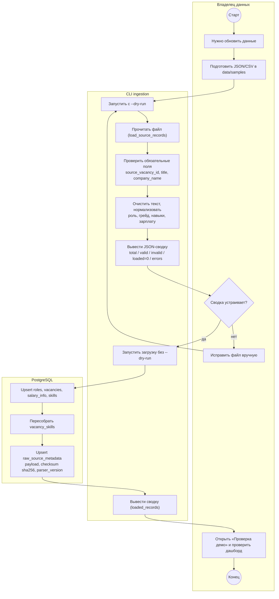
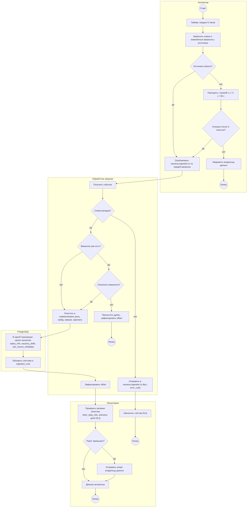

# 03. Процесс сбора и обновления вакансий (BPMN)

Процесс описан в нотации BPMN 2.0 (таблица элементов) и визуализирован как flowchart со swimlanes: дорожка = участник процесса, ромб = шлюз XOR, круг = стартовое или конечное событие.

Связанные требования: US-06, US-07, US-08 ([02-requirements.md](02-requirements.md)).

## 1. AS-IS — как процесс устроен сейчас

Источник фактов: README и `docs/decisions.md` исходного репозитория, модуль `app/services/ingestion.py`.

Сейчас данные загружаются из подготовленных файлов вручную. Прямых коннекторов к API источников нет.

### Элементы процесса

| № | Элемент BPMN | Дорожка | Описание |
|---|---|---|---|
| 1 | Стартовое событие «Нужно обновить данные» | Владелец данных | Ручной триггер |
| 2 | Задача (ручная) «Подготовить JSON/CSV» | Владелец данных | Файл в `data/samples/`; JSON — массив или объект с ключом `items`; CSV читается через `DictReader` |
| 3 | Задача (скрипт) «Запустить dry-run» | CLI ingestion | `python -m app.services.ingestion --input … --source manual --dry-run` |
| 4 | Задача (скрипт) «Проверить обязательные поля» | CLI ingestion | `source_vacancy_id`, `title`, `company_name` (`validate_required_fields()`) |
| 5 | Задача (скрипт) «Очистить и нормализовать» | CLI ingestion | `clean_text()`, роль, грейд, навыки, зарплата, формат работы |
| 6 | Шлюз XOR «Сводка устраивает?» | Владелец данных | Смотрит `invalid_records` и `errors`; нет → вернуться к шагу 2 |
| 7 | Задача (скрипт) «Запустить загрузку» | CLI ingestion | Тот же запуск без `--dry-run` |
| 8 | Задача (сервисная) «Upsert в PostgreSQL» | PostgreSQL | `roles`, `vacancies`, `salary_info`, `skills`, пересборка `vacancy_skills`, `raw_source_metadata` |
| 9 | Задача (ручная) «Проверить дашборд» | Владелец данных | Раздел «Проверка демо» |
| 10 | Конечное событие «Данные обновлены» | Владелец данных | — |

Витрины `analytics.*` — обычные `VIEW` (`CREATE OR REPLACE VIEW`), поэтому отдельный шаг обновления витрин в AS-IS не нужен: данные актуальны сразу после коммита.

### Диаграмма AS-IS

Исходник PlantUML: [diagrams/bpmn-as-is.puml](diagrams/bpmn-as-is.puml)

### Проблемы AS-IS

| № | Проблема | Последствие |
|---|---|---|
| P-1 | Ручной запуск, нет расписания | Данные устаревают, обновление зависит от человека |
| P-2 | Нет прямых коннекторов к источникам | Файлы готовятся вручную, возможны ошибки подготовки |
| P-3 | Отклонённые записи видны только в выводе консоли | Нет истории ошибок, нельзя вернуться к ним позже (в `docs/decisions.md` отмечено: нет audit-таблицы для rejected rows) |
| P-4 | Нет журнала загрузок | Нельзя ответить на вопрос «когда и сколько загрузили» |
| P-5 | Проверка результата — визуальная | Ошибка нормализации может остаться незамеченной |

## 2. TO-BE — целевой процесс

**Весь TO-BE-процесс — (проектное решение, в текущей реализации отсутствует).** Он снимает проблемы P-1…P-5 и опирается на интеграцию из [07-integration.md](07-integration.md).

### Элементы процесса

| № | Элемент BPMN | Дорожка | Описание | Закрывает |
|---|---|---|---|---|
| 1 | Стартовое событие-таймер «Каждые 6 часов» | Коллектор | Cron / планировщик | P-1 |
| 2 | Задача (сервисная) «Запросить новые и изменённые вакансии» | Коллектор | API источника, фильтр по дате изменения, соблюдение лимитов | P-2 |
| 3 | Шлюз XOR «Источник ответил?» | Коллектор | Нет → повтор с backoff 1 с / 5 с / 30 с, после 3 неудач — уведомление владельцу данных | — |
| 4 | Задача (отправка) «Опубликовать `vacancy.ingested.v1`» | Коллектор | По одному сообщению на вакансию, ключ `source_name:source_vacancy_id` | — |
| 5 | Стартовое событие-сообщение «Получено событие» | Обработчик загрузки | Consumer group `skills-radar-loader` | — |
| 6 | Шлюз XOR «Схема валидна?» | Обработчик загрузки | JSON Schema v1 + обязательные поля; нет → DLQ с `error_code` | P-3 |
| 7 | Шлюз XOR «Вакансия уже есть?» | Обработчик загрузки | Поиск по `(source_name, source_vacancy_id)` | — |
| 8 | Шлюз XOR «Checksum изменился?» | Обработчик загрузки | Совпал → пропуск (дубль) | — |
| 9 | Задача «Очистить и нормализовать» | Обработчик загрузки | Те же правила, что в AS-IS (`normalization.py`) | — |
| 10 | Задача «Upsert в одной транзакции» | PostgreSQL | Как в AS-IS + `updated_at` | — |
| 11 | Задача «Записать итог в `ingestion_runs`» | PostgreSQL | Счётчики принято / обновлено / пропущено / в DLQ | P-4 |
| 12 | Задача «Проверить качество данных» | Мониторинг | Доля `other_data_role`, доля `unknown` грейда, доля DLQ; превышение порога → алерт | P-5 |
| 13 | Конечное событие «Данные актуальны» | Мониторинг | — | — |

### Диаграмма TO-BE

Исходник PlantUML: [diagrams/bpmn-to-be.puml](diagrams/bpmn-to-be.puml)

## 3. Сравнение AS-IS и TO-BE

| Аспект | AS-IS | TO-BE |
|---|---|---|
| Старт | Ручной | Таймер каждые 6 ч |
| Источник | Подготовленный файл | API источника + событие `vacancy.ingested.v1` |
| Ошибки формата | Список `errors` в консоли | DLQ с кодом ошибки + счётчик в `ingestion_runs` |
| Дедупликация | Upsert по `(source_name, source_vacancy_id)` | То же + пропуск по неизменившемуся `checksum` |
| История загрузок | Нет | Таблица `ingestion_runs` |
| Контроль качества | Визуальный, раздел «Проверка демо» | Метрики и алерты |
| Витрины | `VIEW`, актуальны сразу | `VIEW`; при росте объёма — `MATERIALIZED VIEW` с `REFRESH … CONCURRENTLY` после окна загрузки |
| Резервный путь | — | Текущий CLI остаётся для начальной загрузки и ручного восстановления |
