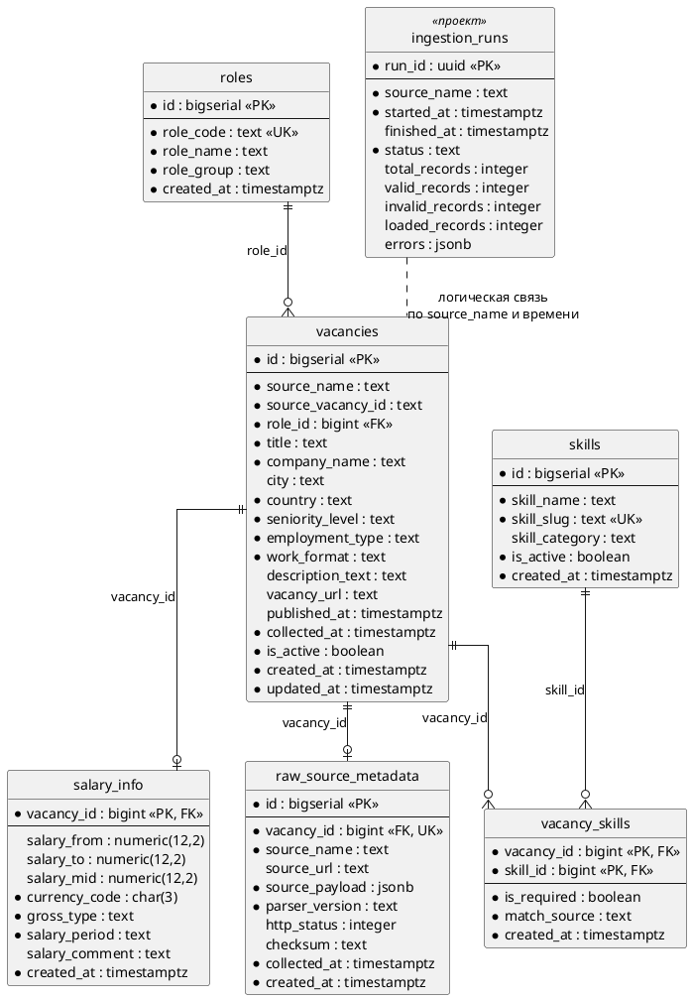

# 04. Модель данных

Источники фактов: `sql/01_init_schema.sql`, `sql/03_analytics_views.sql`, `docs/data_dictionary.md` исходного репозитория.

Модель разделена на слои:

| Слой | Где живёт | Объекты |
|---|---|---|
| Raw | PostgreSQL | `raw_source_metadata` — исходный payload, checksum, версия парсера |
| Cleaned | Python-код во время ingestion (отдельной таблицы нет — осознанное упрощение) | — |
| Final (нормализованный) | PostgreSQL | `roles`, `skills`, `vacancies`, `vacancy_skills`, `salary_info` |
| Analytics | PostgreSQL, схема `analytics` | 5 представлений (`VIEW`) |

Таблицы final- и raw-слоя создаются в схеме по умолчанию (`public`).

## 1. ER-диаграмма

Сущность `ingestion_runs` отмечена стереотипом `<<проект>>` — (проектное решение, в текущей реализации отсутствует).

### Связи

| Связь | Кардинальность | Правило |
|---|---|---|
| `roles` → `vacancies` | 1 : N | `vacancies.role_id` обязателен; нераспознанная роль → `other_data_role` |
| `vacancies` → `salary_info` | 1 : 0..1 | Строка создаётся, только если задана хотя бы одна граница вилки |
| `vacancies` ↔ `skills` | N : M через `vacancy_skills` | PK `(vacancy_id, skill_id)`; при обновлении вакансии связи пересобираются |
| `vacancies` → `raw_source_metadata` | 1 : 0..1 | `vacancy_id` уникален |

## 2. Словарь данных

Обозначения: **Обяз.** — `NOT NULL` в схеме.

### roles — справочник нормализованных ролей

| Поле | Тип | Обяз. | Описание | Значения / пример |
|---|---|---|---|---|
| id | bigserial | да | Суррогатный ключ | 1 |
| role_code | text | да | Стабильный машинный код, UK | `data_analyst`, `product_analyst`, `data_scientist`, `ml_engineer`, `other_data_role` |
| role_name | text | да | Отображаемое название | `Data Analyst` |
| role_group | text | да | Группа ролей, CHECK | `data`, `analytics`, `product`, `ml` |
| created_at | timestamptz | да | Время создания | `now()` |

### skills — справочник навыков

| Поле | Тип | Обяз. | Описание | Значения / пример |
|---|---|---|---|---|
| id | bigserial | да | Суррогатный ключ | 1 |
| skill_name | text | да | Каноническое название | `PostgreSQL` |
| skill_slug | text | да | Стабильный slug, UK | `python`, `sql`, `postgresql`, `pandas`, `numpy`, `scikit-learn`, `a_b_testing`, `machine_learning`, `bi`, `git` |
| skill_category | text | нет | Категория (NULL или непустая строка) | `programming`, `database`, `analytics`, `ml`, `product_analytics`, `bi`, `tooling` |
| is_active | boolean | да | Навык используется в словаре | `true` |
| created_at | timestamptz | да | Время создания | `now()` |

Синонимы навыков задаются в коде (`normalization.py`): например, `Postgres` → `postgresql`, `sklearn` → `scikit-learn`, `AB test` → `a_b_testing`, `Power BI` / `Tableau` → `bi`. `SQL` и `PostgreSQL` — разные навыки.

### vacancies — факт: одна нормализованная вакансия

| Поле | Тип | Обяз. | Описание | Значения / правило |
|---|---|---|---|---|
| id | bigserial | да | Суррогатный ключ | — |
| source_name | text | да | Источник, CHECK | `hh_ru`, `habr_career`, `superjob`, `manual` |
| source_vacancy_id | text | да | ID в источнике | `json-1001`; UK вместе с `source_name` |
| role_id | bigint | да | FK → `roles.id` | Определяется по regex на заголовке |
| title | text | да | Заголовок (очищенный) | `Junior Data Scientist / ML` |
| company_name | text | да | Работодатель | Обязательное поле входной записи |
| city | text | нет | Город | `Moscow` |
| country | text | да | Страна | Заполняется при нормализации |
| seniority_level | text | да | Грейд, CHECK | `intern`, `junior`, `middle`, `senior`, `lead`, `unknown` |
| employment_type | text | да | Тип занятости, CHECK | `full_time`, `part_time`, `internship`, `contract`, `project`, `unknown` |
| work_format | text | да | Формат работы, CHECK | `office`, `remote`, `hybrid`, `unknown` |
| description_text | text | нет | Описание без HTML | Результат `clean_text()` |
| vacancy_url | text | нет | Ссылка на вакансию | — |
| published_at | timestamptz | нет | Дата публикации | CHECK `published_at <= collected_at` |
| collected_at | timestamptz | да | Дата сбора | — |
| is_active | boolean | да | Вакансия открыта | Витрины учитывают только `true` |
| created_at | timestamptz | да | Создание записи | `now()` |
| updated_at | timestamptz | да | Последнее обновление | Обновляется при upsert |

### salary_info — зарплатная вилка (1 : 0..1)

| Поле | Тип | Обяз. | Описание | Значения / правило |
|---|---|---|---|---|
| vacancy_id | bigint | да | PK и FK → `vacancies.id` | — |
| salary_from | numeric(12,2) | нет | Нижняя граница | ≥ 0 |
| salary_to | numeric(12,2) | нет | Верхняя граница | ≥ 0, не меньше `salary_from` |
| salary_mid | numeric(12,2) | нет | Середина вилки | Рассчитывается при нормализации; используется во всех зарплатных витринах |
| currency_code | char(3) | да | Валюта ISO 4217 | `RUB`, `USD`, `EUR`; `RUR` → `RUB` |
| gross_type | text | да | До или после налогов, CHECK | `gross`, `net`, `unknown` |
| salary_period | text | да | Период, CHECK | `month`, `year`, `project`, `unknown`; по умолчанию `month` |
| salary_comment | text | нет | Комментарий | — |
| created_at | timestamptz | да | Создание записи | `now()` |

### vacancy_skills — связь вакансии и навыка

| Поле | Тип | Обяз. | Описание | Значения |
|---|---|---|---|---|
| vacancy_id | bigint | да | PK, FK → `vacancies.id` | — |
| skill_id | bigint | да | PK, FK → `skills.id` | — |
| is_required | boolean | да | Навык обязателен | `true` / `false` |
| match_source | text | да | Откуда извлечён навык, CHECK | `title`, `description`, `manual`, `llm`, `regex` |
| created_at | timestamptz | да | Создание записи | `now()` |

### raw_source_metadata — raw-слой

| Поле | Тип | Обяз. | Описание | Правило |
|---|---|---|---|---|
| id | bigserial | да | Суррогатный ключ | — |
| vacancy_id | bigint | да | FK → `vacancies.id`, UK | — |
| source_name | text | да | Источник | как в `vacancies` |
| source_url | text | нет | URL источника | — |
| source_payload | jsonb | да | Исходная запись целиком | GIN-индекс для поиска по JSON |
| parser_version | text | да | Версия правил | сейчас `rule_based_v1` |
| http_status | integer | нет | HTTP-код при сборе | для файлов не заполняется |
| checksum | text | нет | Хэш payload | SHA-256 от JSON с сортировкой ключей |
| collected_at | timestamptz | да | Время сбора | — |
| created_at | timestamptz | да | Создание записи | `now()` |

### ingestion_runs — журнал загрузок (проектное решение, в текущей реализации отсутствует)

| Поле | Тип | Обяз. | Описание |
|---|---|---|---|
| run_id | uuid | да | ID прогона |
| source_name | text | да | Источник |
| started_at / finished_at | timestamptz | да / нет | Время начала и конца |
| status | text | да | `running`, `success`, `partial`, `failed` |
| total_records, valid_records, invalid_records, loaded_records | integer | нет | Те же счётчики, что в `IngestionResult` |
| errors | jsonb | нет | Список ошибок по записям |

### Индексы

| Индекс | Назначение |
|---|---|
| `idx_vacancies_role_seniority_published_at` | Фильтр по роли, грейду и времени |
| `idx_vacancies_published_at` | Временные ряды |
| `idx_vacancies_country_city` | География |
| `idx_vacancy_skills_skill_id_vacancy_id` | Аналитика по навыкам |
| `idx_salary_info_currency_period_mid` | Зарплатная аналитика |
| `idx_raw_source_metadata_payload_gin` | Поиск по JSON-payload |

## 3. Маппинг входной записи в модель

Пример входной записи — `data/samples/prepared_vacancies.json` (массив объектов).

| Поле входного JSON | Куда попадает | Преобразование |
|---|---|---|
| `id` | `vacancies.source_vacancy_id` | Алиас поля (`FIELD_ALIASES`) |
| `title` | `vacancies.title`, роль, грейд | `clean_text()`; regex ролей и грейдов |
| `company` | `vacancies.company_name` | Алиас поля |
| `location` / `city` + `country` | `vacancies.city`, `vacancies.country` | Разбор местоположения (в примерах встречаются и `location`, и отдельные `city`/`country`) |
| `description` | `vacancies.description_text`, навыки | Удаление HTML; поиск синонимов навыков |
| `skills` | `vacancy_skills` | Словарь синонимов; структурированный список надёжнее regex |
| `published_at` | `vacancies.published_at` | Парсинг ISO 8601 |
| `salary_from`, `salary_to` | `salary_info` | Числа, расчёт `salary_mid` |
| `currency` | `salary_info.currency_code` | Верхний регистр, `RUR` → `RUB` |
| `gross_type`, `salary_period` | `salary_info` | Нормализация к допустимым значениям |
| `url` | `vacancies.vacancy_url` | — |
| `employment_type`, `work_format` | `vacancies` | Нормализация, иначе `unknown` |
| вся запись | `raw_source_metadata.source_payload` | Без изменений + checksum |

## 4. Витрины (схема `analytics`)

Все витрины — `CREATE OR REPLACE VIEW`, учитывают только `vacancies.is_active = true`.

| Витрина | Зерно (одна строка =) | Поля | Логика | API |
|---|---|---|---|---|
| `analytics.top_skills_by_role` | роль + грейд + навык | role_code, role_name, seniority_level, skill_slug, skill_name, vacancy_count, vacancy_share, skill_rank | `vacancy_share` = доля вакансий группы с навыком; `skill_rank` = `ROW_NUMBER()` по убыванию `vacancy_count` внутри роли и грейда | `GET /skills/top` |
| `analytics.skills_trend_monthly` | месяц + роль + грейд + навык | month_start, role_code, role_name, seniority_level, skill_slug, skill_name, vacancy_count, vacancy_share | Месяц = начало месяца от `COALESCE(published_at, collected_at)` | `GET /skills/trends` |
| `analytics.role_skill_distribution` | роль + грейд + навык | role_code, role_name, seniority_level, skill_slug, skill_name, vacancy_count, skill_penetration_in_role, role_share_of_skill, required_share | Проникновение навыка в роль; доля роли в спросе на навык; доля «обязательных» упоминаний | `GET /skills/distribution` (проектное решение, в текущей реализации отсутствует) |
| `analytics.skill_salary_premium` | роль + грейд + навык | role_code, role_name, seniority_level, skill_slug, skill_name, vacancies_with_skill, vacancies_without_skill, median_salary_with_skill, median_salary_without_skill, salary_premium_abs, salary_premium_pct | Только `currency_code = 'RUB'` и `salary_period = 'month'`; обе группы непустые; разница медиан | `GET /salary/premium` |
| `analytics.junior_roles_overview` | роль + грейд (intern, junior) | role_code, role_name, seniority_level, total_vacancies, salary_vacancies, salary_coverage, median_salary_mid, average_salary_mid | `seniority_level IN ('intern','junior')`; зарплата — RUB в месяц; медиана и среднее по `salary_mid` | `GET /overview/junior` |

### Правила качества данных

| ID | Правило | Где проверяется |
|---|---|---|
| DQ-01 | Обязательные поля `source_vacancy_id`, `title`, `company_name` | `validate_required_fields()` |
| DQ-02 | Нет дублей по `(source_name, source_vacancy_id)` | UNIQUE + upsert |
| DQ-03 | Зарплата неотрицательна, `salary_from ≤ salary_to` | CHECK |
| DQ-04 | `published_at ≤ collected_at` | CHECK |
| DQ-05 | Перечислимые значения из допустимого списка | CHECK |
| DQ-06 | Доля `other_data_role` ≤ 15 % и доля `seniority_level = unknown` ≤ 20 % | Мониторинг (проектное решение, в текущей реализации отсутствует) |
