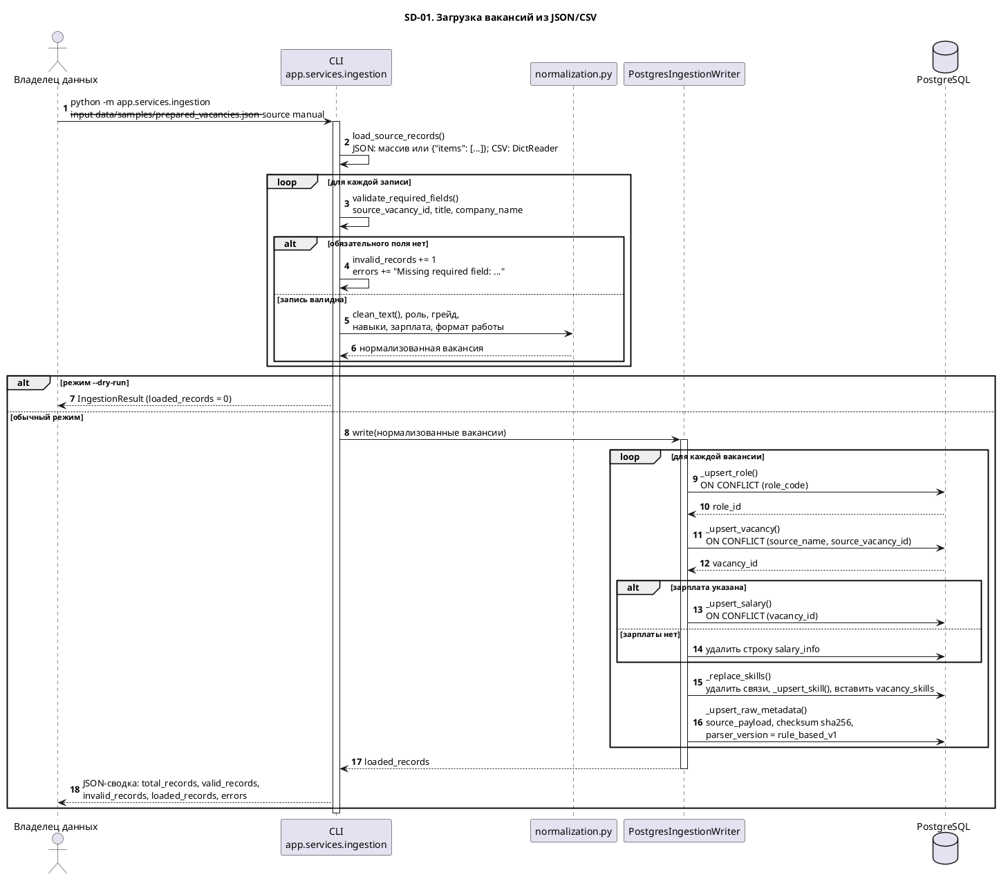
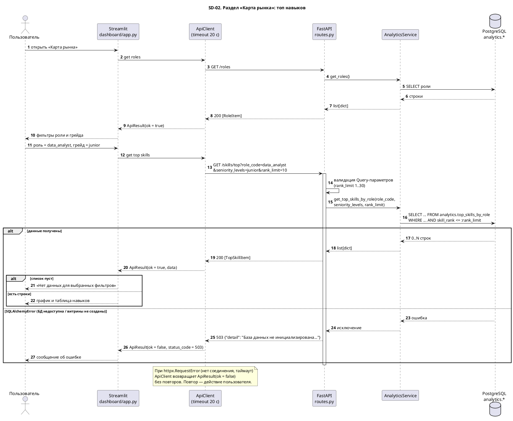
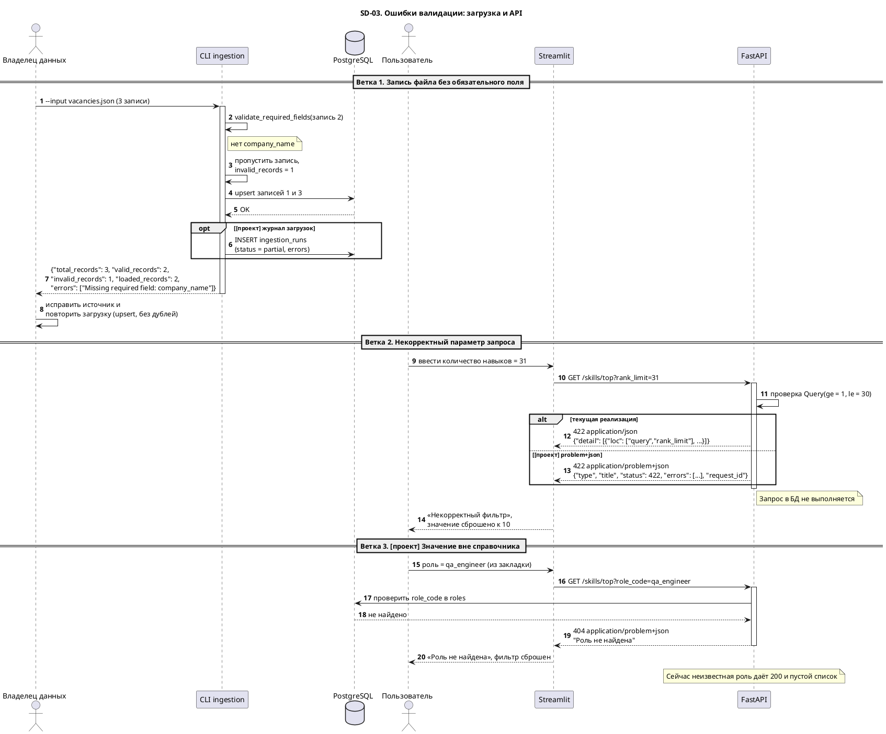

# 06. Sequence-диаграммы

| ID | Сценарий | Статус | Связи |
|---|---|---|---|
| SD-01 | Загрузка вакансий из файла через CLI | Реализовано | US-06, US-07, BPMN AS-IS |
| SD-02 | Запрос дашборда «Карта рынка» через API | Реализовано | US-01, UC-01, `GET /skills/top` |
| SD-03 | Обработка ошибок валидации: запись файла и параметр API | Реализовано; ветка журнала и problem+json — проектное решение | US-07, US-01 AC3 |

Имена функций и классов взяты из `app/services/ingestion.py`, `app/api/routes.py`, `dashboard/api_client.py`.

## SD-01. Загрузка вакансий из файла (реализовано)

Ключевые решения:

- Повторный запуск безопасен: все записи — upsert по бизнес-ключам.
- Связи навыков пересобираются целиком, поэтому удалённый из вакансии навык не «зависает» в `vacancy_skills`.
- Витрины — обычные `VIEW`, данные в них актуальны сразу после записи.

## SD-02. Запрос дашборда через API (реализовано)

Условие `skill_rank <= :rank_limit` показывает смысл фильтра; точный текст SQL-запроса находится в `app/services/analytics.py`.

## SD-03. Обработка ошибок валидации

Две ветки: ошибка данных при загрузке и ошибка параметра при запросе к API. Шаги, помеченные `[проект]`, — (проектное решение, в текущей реализации отсутствует).

