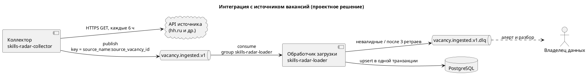

# 07. Спецификация интеграции с источником вакансий

> **Весь документ — проектное решение, в текущей реализации отсутствует.**
> Сейчас IT Skills Radar загружает подготовленные JSON/CSV через CLI, прямых коннекторов к источникам нет (`docs/decisions.md`: «нет прямых внешних API-коннекторов»; `docs/architecture.md`: очереди сообщений и оркестраторы сознательно не используются).
> Ниже — целевая интеграция, которую я спроектировал как аналитик. Из реального кода взяты: бизнес-ключ, допустимые `source_name`, обязательные поля, правило checksum, версия парсера и целевые таблицы.

Версия спецификации: 1.0 · Связи: BPMN TO-BE ([03-process-bpmn.md](03-process-bpmn.md)), US-06, US-07.

## 1. Выбор способа интеграции (ADR-001)

| Критерий | Пакетная загрузка файла по расписанию | Событие в брокере сообщений (Kafka) |
|---|---|---|
| Сложность | Низкая — уже есть CLI | Выше: брокер, consumer group, DLQ |
| Задержка данных | Часы | Минуты |
| Обработка ошибок | Весь файл или список ошибок | Поштучно, с DLQ |
| Несколько потребителей | Неудобно | Естественно (consumer groups) |
| Повторная обработка | Перезапуск файла | Сдвиг offset / replay |

**Решение.** Коллектор забирает вакансии из API источника по расписанию и публикует по одному событию `vacancy.ingested.v1` на вакансию. Обработчик загрузки читает события и пишет в PostgreSQL теми же правилами, что и текущий CLI.
**Последствия.** Появляются брокер и DLQ, растёт сложность эксплуатации. Текущий CLI остаётся резервным путём для начальной загрузки и восстановления.
**Отклонённая альтернатива.** Прямая запись коллектора в БД: проще, но смешивает сбор и нормализацию и не даёт поштучной обработки ошибок.

## 2. Участники

| Участник | Роль | Ответственность |
|---|---|---|
| API источника вакансий (например, публичный API hh.ru) | Поставщик данных | Отдаёт вакансии; ограничивает частоту запросов; требует `User-Agent` с контактом |
| Коллектор (`skills-radar-collector`) | Продюсер | Опрос источника, маппинг в формат события, расчёт checksum, публикация |
| Kafka, топик `vacancy.ingested.v1` | Транспорт | Хранение и доставка событий |
| Обработчик загрузки (`skills-radar-loader`) | Консьюмер | Валидация схемы, дедупликация, нормализация, запись в БД |
| Топик `vacancy.ingested.v1.dlq` | Карантин | Сообщения, которые нельзя обработать |
| PostgreSQL | Хранилище | `vacancies`, `salary_info`, `vacancy_skills`, `raw_source_metadata`, `ingestion_runs` |
| Владелец данных | Эксплуатация | Разбор DLQ, реакция на алерты |



## 3. Формат сообщения

| Свойство | Значение |
|---|---|
| Топик | `vacancy.ingested.v1` |
| Ключ | `<source_name>:<source_vacancy_id>`, например `hh_ru:98765432` — все версии одной вакансии попадают в одну партицию и обрабатываются по порядку |
| Заголовки | `event_id`, `content-type: application/json`, `schema-version: 1` |
| Кодировка | UTF-8, JSON |
| Партиции | 3 |
| Хранение | Основной топик — 7 дней, DLQ — 30 дней |
| Максимальный размер | 1 МБ (описание вакансии обрезается до 50 000 символов) |

### Пример сообщения

```json
{
  "event_id": "6f1c2b0e-8a53-4c1e-9d0a-2f4b7c9e1a11",
  "event_type": "vacancy.ingested",
  "event_version": 1,
  "occurred_at": "2026-09-10T09:15:00+03:00",
  "source_name": "hh_ru",
  "source_vacancy_id": "98765432",
  "source_url": "https://api.hh.ru/vacancies/98765432",
  "http_status": 200,
  "parser_version": "rule_based_v1",
  "checksum": "sha256:4be1f0c2a9d8e7b6c5a4f3e2d1c0b9a8f7e6d5c4b3a2f1e0d9c8b7a6f5e4d3c9",
  "vacancy": {
    "title": "Junior Data Analyst",
    "company_name": "Пример Компания",
    "city": "Москва",
    "country": "Россия",
    "employment_type": "full_time",
    "work_format": "hybrid",
    "published_at": "2026-09-09T12:00:00+03:00",
    "is_active": true,
    "description": "<p>Требования: SQL, Python, Power BI</p>",
    "vacancy_url": "https://hh.ru/vacancy/98765432",
    "skills": ["SQL", "Python", "Power BI"],
    "salary": {
      "from": 90000,
      "to": 120000,
      "currency": "RUR",
      "gross_type": "gross",
      "period": "month"
    }
  }
}
```

Сообщение содержит сырые значения (`RUR`, HTML в описании, синонимы навыков). Нормализация выполняется в обработчике, чтобы правила жили в одном месте (`normalization.py`) и при их изменении можно было переобработать события.

### JSON Schema v1

```json
{
  "$schema": "https://json-schema.org/draft/2020-12/schema",
  "$id": "https://it-skills-radar.local/schemas/vacancy.ingested.v1.json",
  "title": "vacancy.ingested v1",
  "type": "object",
  "additionalProperties": false,
  "required": [
    "event_id", "event_type", "event_version", "occurred_at",
    "source_name", "source_vacancy_id", "parser_version", "checksum", "vacancy"
  ],
  "properties": {
    "event_id": { "type": "string", "format": "uuid" },
    "event_type": { "const": "vacancy.ingested" },
    "event_version": { "const": 1 },
    "occurred_at": { "type": "string", "format": "date-time" },
    "source_name": { "enum": ["hh_ru", "habr_career", "superjob", "manual"] },
    "source_vacancy_id": { "type": "string", "minLength": 1, "maxLength": 64 },
    "source_url": { "type": ["string", "null"], "format": "uri" },
    "http_status": { "type": ["integer", "null"], "minimum": 100, "maximum": 599 },
    "parser_version": { "type": "string", "minLength": 1 },
    "checksum": { "type": "string", "pattern": "^sha256:[a-f0-9]{64}$" },
    "vacancy": {
      "type": "object",
      "additionalProperties": true,
      "required": ["title", "company_name"],
      "properties": {
        "title": { "type": "string", "minLength": 1 },
        "company_name": { "type": "string", "minLength": 1 },
        "city": { "type": ["string", "null"] },
        "country": { "type": ["string", "null"] },
        "employment_type": { "type": ["string", "null"] },
        "work_format": { "type": ["string", "null"] },
        "published_at": { "type": ["string", "null"], "format": "date-time" },
        "is_active": { "type": "boolean", "default": true },
        "description": { "type": ["string", "null"], "maxLength": 50000 },
        "vacancy_url": { "type": ["string", "null"], "format": "uri" },
        "skills": {
          "type": "array",
          "items": { "type": "string", "minLength": 1 },
          "default": []
        },
        "salary": {
          "type": ["object", "null"],
          "properties": {
            "from": { "type": ["number", "null"], "minimum": 0 },
            "to": { "type": ["number", "null"], "minimum": 0 },
            "currency": { "type": "string", "pattern": "^[A-Z]{3}$" },
            "gross_type": { "type": ["string", "null"] },
            "period": { "type": ["string", "null"] }
          }
        }
      }
    }
  }
}
```

Обязательные поля вакансии совпадают с текущим ingestion: `source_vacancy_id` (на верхнем уровне), `title`, `company_name`.

### Маппинг события в модель данных

| Поле события | Таблица.поле |
|---|---|
| `source_name`, `source_vacancy_id` | `vacancies.source_name`, `vacancies.source_vacancy_id` (бизнес-ключ) |
| `vacancy.title` | `vacancies.title` + определение `role_id` и `seniority_level` |
| `vacancy.company_name`, `city`, `country` | `vacancies.*` |
| `vacancy.employment_type`, `work_format` | `vacancies.*` после нормализации, иначе `unknown` |
| `vacancy.description` | `vacancies.description_text` после `clean_text()` |
| `vacancy.skills` + `title` + `description` | `vacancy_skills` через словарь синонимов |
| `vacancy.salary.*` | `salary_info.*` (`RUR` → `RUB`) |
| `vacancy.published_at` | `vacancies.published_at` |
| `occurred_at` | `vacancies.collected_at`, `raw_source_metadata.collected_at` |
| всё сообщение | `raw_source_metadata.source_payload` |
| `checksum`, `parser_version`, `http_status`, `source_url` | `raw_source_metadata.*` |

## 4. Расписание и SLA

| Параметр | Значение |
|---|---|
| Расписание опроса | Каждые 6 часов (00:00, 06:00, 12:00, 18:00 МСК) |
| Окно выборки | Вакансии, изменённые с момента прошлого успешного запуска, минус 15 минут перекрытия |
| Лимит к источнику | Не более 5 запросов в секунду; при `429` — ожидание по `Retry-After` |
| Свежесть данных (end-to-end) | ≤ 7 часов с момента изменения вакансии в источнике |
| Задержка обработки события | p95 ≤ 5 с от публикации до коммита в БД |
| Пропускная способность | ≥ 50 событий в секунду на одном экземпляре обработчика |
| Доля событий в DLQ | ≤ 1 % за прогон |
| Время реакции на алерт | В течение рабочего дня (учебный проект, дежурства нет) |

## 5. Идемпотентность и порядок

- **Гарантия доставки** — at-least-once: offset фиксируется только после `COMMIT` в БД.
- **Бизнес-ключ** — `(source_name, source_vacancy_id)`, в БД уже есть `UNIQUE`.
- **Дедупликация**: обработчик читает текущий `raw_source_metadata.checksum` по ключу.
  - checksum совпал → событие пропускается, offset фиксируется;
  - checksum отличается или записи нет → upsert всех таблиц в одной транзакции.
- **Checksum** считается продюсером так же, как сейчас в `ingestion.py`: SHA-256 от JSON с отсортированными ключами (в событии — с префиксом `sha256:`).
- **Порядок**: ключ сообщения гарантирует порядок внутри вакансии. Дополнительно обработчик не применяет событие, если его `occurred_at` старше `vacancies.collected_at` — это защищает от устаревших повторов.
- **Закрытие вакансии**: событие с `vacancy.is_active = false` обновляет `vacancies.is_active`, строка не удаляется; витрины перестают её учитывать.

## 6. Ретраи и DLQ

| Тип ошибки | Пример | Действие |
|---|---|---|
| Временная ошибка источника | `5xx`, таймаут 10 с, `429` | Коллектор: 3 повтора с экспоненциальной задержкой 1 с / 5 с / 30 с (+ случайный разброс до 20 %); затем прогон помечается `failed`, алерт |
| Нарушение схемы | Нет `company_name`, неверный `checksum` | Сразу в DLQ, без повторов |
| Нарушение бизнес-правил БД | `salary_from > salary_to`, `published_at > collected_at` | Сразу в DLQ с кодом `DB_CONSTRAINT` |
| Временная ошибка БД | Потеря соединения, deadlock | Обработчик: 3 повтора 1 с / 5 с / 30 с; затем в DLQ с кодом `DB_UNAVAILABLE`; при недоступности БД дольше 5 минут потребление приостанавливается |
| Неизвестная ошибка | Исключение в нормализации | В DLQ с кодом `UNEXPECTED` и stack trace в логах |

Сообщение в DLQ — исходное событие плюс заголовки:

```json
{
  "dlq_reason_code": "SCHEMA_VALIDATION",
  "dlq_reason": "vacancy.company_name: required property missing",
  "dlq_attempts": 1,
  "dlq_failed_at": "2026-09-10T09:15:02+03:00",
  "dlq_consumer": "skills-radar-loader",
  "original_topic": "vacancy.ingested.v1",
  "original_partition": 1,
  "original_offset": 10452
}
```

Разбор DLQ: владелец данных исправляет причину (правило нормализации, маппинг коллектора) и переотправляет сообщения в основной топик утилитой replay. Благодаря идемпотентности повторная отправка безопасна.

## 7. Версионирование

- Добавление необязательного поля — в рамках `v1`.
- Ломающее изменение — новый топик `vacancy.ingested.v2`; продюсер пишет в оба топика не менее 1 месяца, пока обработчик не перейдёт на `v2`.
- Схемы хранятся в репозитории рядом с кодом и проверяются контрактным тестом в CI.

## 8. Мониторинг

| Метрика | Тип | Порог алерта |
|---|---|---|
| `collector_run_status` | gauge (0/1) | Прогон `failed` или прошло > 7 ч с последнего успешного |
| `collector_source_requests_total{status}` | counter | Доля `429` + `5xx` > 10 % за прогон |
| `loader_events_processed_total{result}` | counter (`inserted`, `updated`, `skipped_duplicate`, `dlq`) | — |
| `loader_dlq_ratio` | gauge | > 1 % за прогон |
| `kafka_consumer_lag` (group `skills-radar-loader`) | gauge | > 5 000 сообщений дольше 15 мин |
| `loader_processing_seconds` | histogram | p95 > 5 с |
| `dq_other_data_role_share` | gauge | > 15 % новых вакансий |
| `dq_unknown_seniority_share` | gauge | > 20 % новых вакансий |

Логи — JSON с полями `event_id`, `source_name`, `source_vacancy_id`, `result`, `duration_ms`. Итог каждого прогона пишется в `ingestion_runs` и доступен через `GET /ingestion/runs/{run_id}` (см. [05-api.md](05-api.md)).
