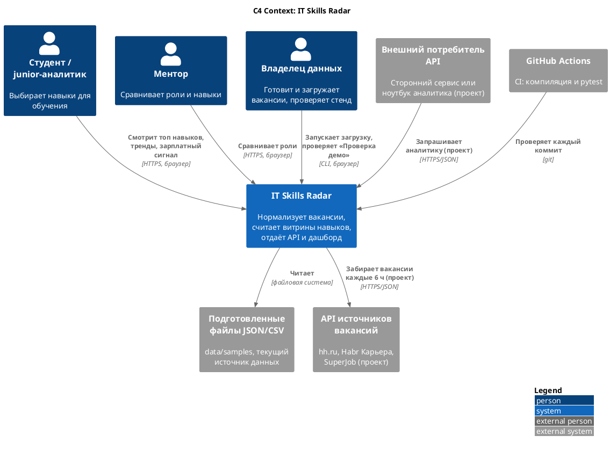
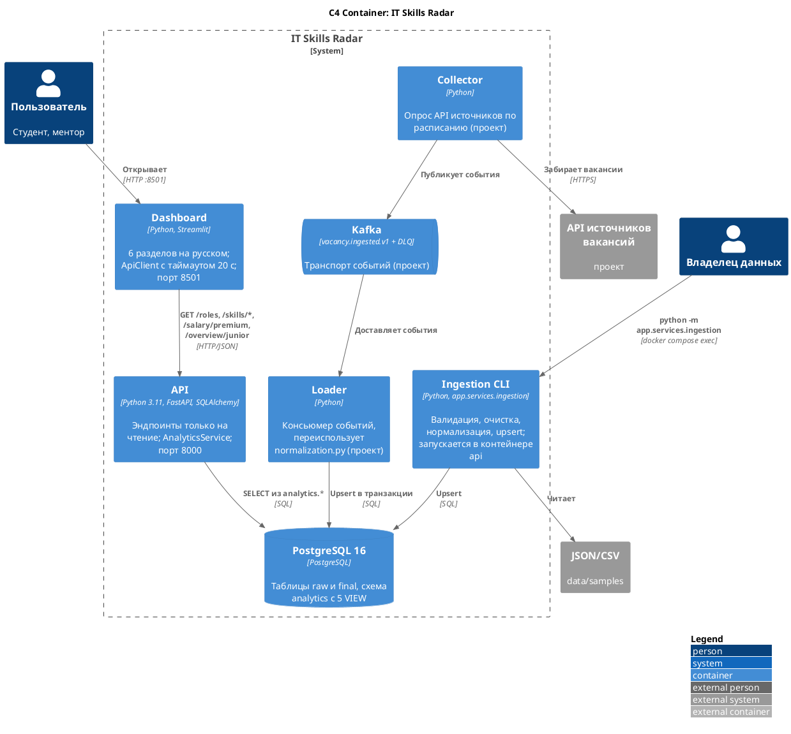

# 08. Архитектура и нефункциональные требования

Источники фактов: `docs/architecture.md`, `docker-compose.yml`, `.github/workflows/ci.yml`, `dashboard/api_client.py` исходного репозитория.

## 1. C4 Level 1 — System Context

Внешние участники, отмеченные «проект», — (проектное решение, в текущей реализации отсутствует).

## 2. C4 Level 2 — Containers

Текущие контейнеры соответствуют `docker-compose.yml`: `db`, `api`, `dashboard`. Контейнеры коллектора, брокера и обработчика — (проектное решение, в текущей реализации отсутствует).

### Архитектурные решения

| ID | Решение | Обоснование | Статус |
|---|---|---|---|
| AD-01 | Слои raw → final → analytics в одной PostgreSQL | Трассировка и простота; отдельный cleaned-слой живёт в Python | Реализовано |
| AD-02 | Витрины как обычные `VIEW` | Данные всегда актуальны, объём небольшой | Реализовано |
| AD-03 | Rule-based нормализация без NLP | Детерминированность, объяснимость, тестируемость | Реализовано |
| AD-04 | Дашборд ходит в БД только через API | Один контракт, UI не зависит от схемы БД | Реализовано |
| AD-05 | Без очередей, оркестраторов, менеджера секретов и сложных миграций | Осознанное упрощение для пет-проекта (`docs/architecture.md`) | Реализовано |
| AD-06 | Переход на события `vacancy.ingested.v1` | Автоматическое обновление и поштучная обработка ошибок ([07-integration.md](07-integration.md)) | Проектное решение, в текущей реализации отсутствует |
| AD-07 | Переход витрин на `MATERIALIZED VIEW` | Когда p95 API превысит 500 мс на реальном объёме | Проектное решение, в текущей реализации отсутствует |

## 3. Нефункциональные требования

Сводная таблица НФТ — в [02-requirements.md](02-requirements.md#3-нефункциональные-требования). Здесь — как каждое требование проверяется.

| Категория | Требование | Метрика и порог | Как проверяем | Статус |
|---|---|---|---|---|
| Производительность | Время ответа аналитических эндпоинтов | p95 ≤ 500 мс при 10 000 вакансий и 10 параллельных пользователях | `make load-test-10k` + нагрузочный скрипт (locust / k6) | Объём — реализовано; порог и нагрузочный тест — проектное решение, в текущей реализации отсутствует |
| Производительность | Загрузка 10 000 вакансий | ≤ 5 мин | Замер времени CLI | Проектное решение, в текущей реализации отсутствует |
| Надёжность | Идемпотентность загрузки | 0 дублей при повторе | Тест: загрузить файл дважды, сравнить `count(*)` | Реализовано (upsert + UNIQUE) |
| Надёжность | Поведение при недоступной БД | API отвечает 503 с понятным `detail`, не падает | Тесты API (`tests/test_api.py`) и ручная остановка `db` | Реализовано |
| Надёжность | Порядок запуска контейнеров | `api` стартует после healthy `db`, `dashboard` — после healthy `api` | healthcheck в `docker-compose.yml` | Реализовано |
| Доступность | Демо-стенд в окно показа | ≥ 99 % | Внешний пинг `GET /health` раз в минуту | Проектное решение, в текущей реализации отсутствует |
| Целостность | Корректность значений | CHECK, FK, UNIQUE | Ограничения в `sql/01_init_schema.sql`; тест `tests/test_schema_files.py` проверяет SQL-файлы | Реализовано |
| Безопасность | Секреты | Только в `.env`, не в git | `.gitignore`, `.env.example` | Реализовано |
| Безопасность | Доступ к API извне | API-ключ, лимит 60 запросов в минуту на ключ | Тест на `401` и `429` | Проектное решение, в текущей реализации отсутствует |
| Безопасность | Права БД | API работает под ролью только на чтение `analytics.*` | Проверка `GRANT` | Проектное решение, в текущей реализации отсутствует |
| Сопровождаемость | Автотесты в CI | Каждый коммит: компиляция + pytest, 100 % зелёных сборок в `main` | GitHub Actions | Реализовано |
| Сопровождаемость | Покрытие | ≥ 80 % строк для `normalization.py` и `ingestion.py` | `pytest --cov` в CI | Проектное решение, в текущей реализации отсутствует |
| Переносимость | Запуск на новой машине | ≤ 10 мин, нужен только Docker | `docker compose up --build -d` | Реализовано |
| Юзабилити | Язык и понятность | Интерфейс на русском; у зарплатных данных — дисклеймер | Ревью дашборда | Реализовано |
| Юридические | Использование данных источников | Соблюдение правил API, лимитов, атрибуция | Ревью коллектора | Проектное решение, в текущей реализации отсутствует |

## 4. Наблюдаемость

### Что есть сейчас

- Healthcheck всех трёх контейнеров в `docker-compose.yml`, эндпоинт `GET /health`.
- Раздел дашборда «Проверка демо» — проверка API, БД, витрин и данных.
- JSON-сводка каждой загрузки (`IngestionResult`).
- Понятные тексты ошибок 503/500 с названием операции.

### Что добавить (проектное решение, в текущей реализации отсутствует)

| Сигнал | Что собираем | Инструмент | Пример использования |
|---|---|---|---|
| Логи | JSON-строка на каждый запрос: `timestamp`, `level`, `request_id`, `method`, `path`, `query`, `status`, `duration_ms` | stdout контейнера → Loki | Найти запрос пользователя по `request_id` из problem+json |
| Метрики API | `http_requests_total{path,status}`, `http_request_duration_seconds` (histogram) | `prometheus-fastapi-instrumentator` → Prometheus | p95 по эндпоинтам, доля 5xx |
| Метрики БД | Число соединений, время запросов к витринам | `postgres_exporter`, `pg_stat_statements` | Решение о переходе на `MATERIALIZED VIEW` (AD-07) |
| Метрики загрузки | Счётчики `IngestionResult`, доля `other_data_role` и `unknown` | Prometheus pushgateway или таблица `ingestion_runs` | Контроль качества нормализации |
| Трассировка | Спаны Streamlit → FastAPI → PostgreSQL | OpenTelemetry → Jaeger | Поиск медленного шага |
| Дашборд | Latency, error rate, свежесть данных, DLQ | Grafana | Ежедневная проверка |

### Алерты

| Алерт | Условие | Кому |
|---|---|---|
| API недоступен | `GET /health` не 200 три минуты подряд | Владелец данных |
| Рост ошибок | Доля 5xx > 5 % за 5 минут | Владелец данных |
| Медленный API | p95 > 500 мс за 15 минут | Владелец данных |
| Данные устарели | `max(collected_at)` старше 7 часов (после перехода на TO-BE) | Владелец данных |
| Качество нормализации | `other_data_role` > 15 % или `unknown` грейд > 20 % новых вакансий | Владелец данных |
